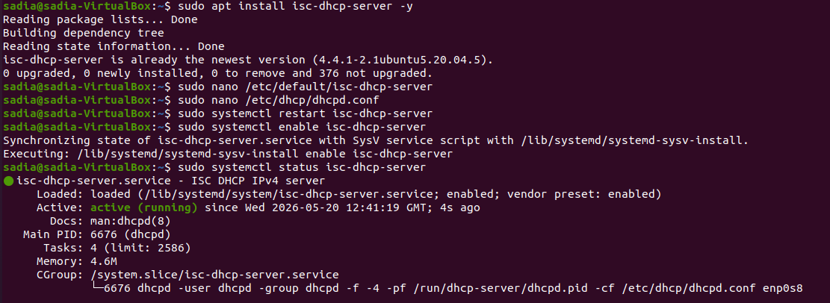
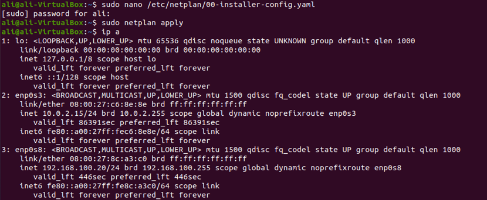
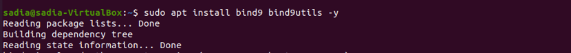
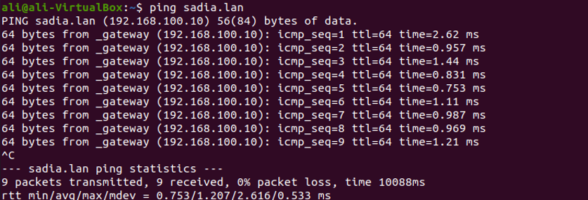
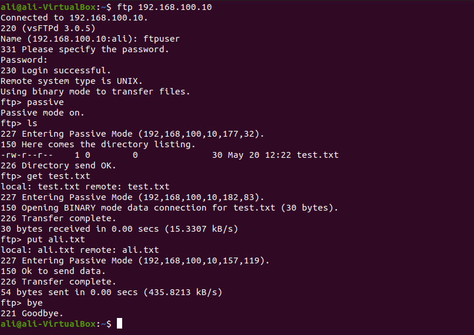
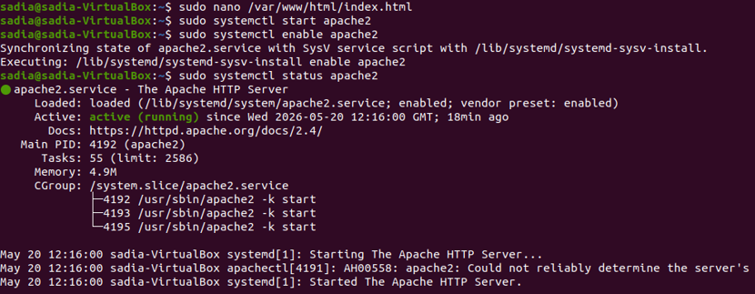
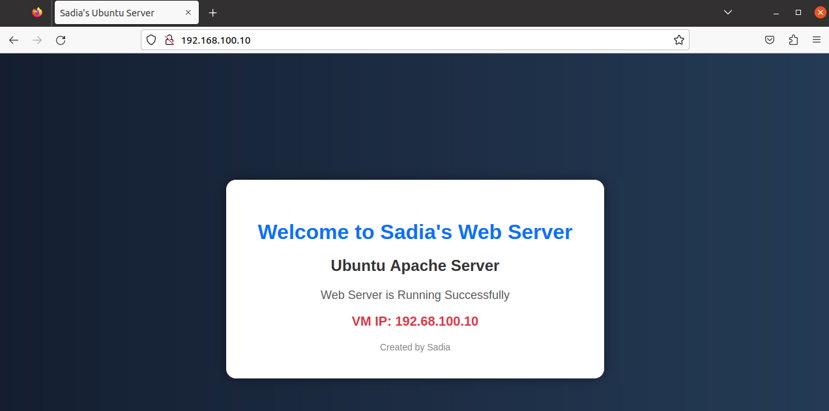
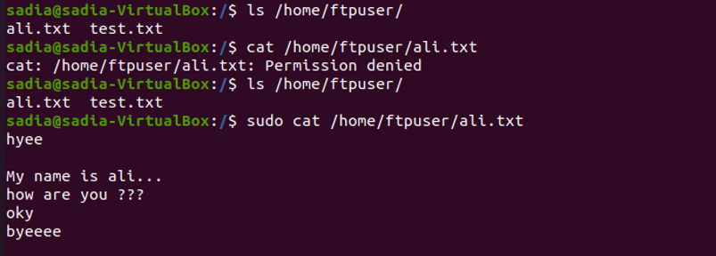

# 🌐 Network Server Configuration using VirtualBox & Ubuntu 20.04

## 📋 Project Overview

This project demonstrates the implementation of a complete Local Area Network (LAN) using VirtualBox and Ubuntu 20.04. A Server VM and a Client VM were created and connected through an Internal Network. DHCP, DNS, FTP, and Apache Web Server were configured and tested successfully.

---

## 🛠️ Network Configuration

| Component | Configuration |
|-----------|---------------|
| Server IP | 192.168.10.100 |
| Client IP | Assigned automatically by DHCP |
| Domain | sadia.lan |
| Network Type | Internal Network |
| Platform | VirtualBox |
| Operating System | Ubuntu 20.04 |

---

## 🛠️ Services Configured

| Service | Purpose | Status |
|---------|---------|--------|
| FTP (vsftpd) | File Transfer | ✅ Active |
| Apache2 | Web Hosting | ✅ Active |
| BIND9 | DNS Resolution | ✅ Active |
| ISC DHCP Server | Dynamic IP Assignment | ✅ Active |

---

## 📌 Project Steps

### 1. Created Server and Client Virtual Machines

- Installed Ubuntu 20.04 on both VMs.
- Connected both VMs using VirtualBox Internal Network.

### 2. Configured Static IP

- Assigned a static IP (192.168.10.100) to the Server using Netplan.

### 3. Configured DHCP Server

- Installed ISC DHCP Server.
- Configured IP address range for automatic allocation.
- Verified that the Client received an IP automatically.

### 4. Configured DNS Server

- Installed BIND9.
- Created a custom domain (**sadia.lan**).
- Verified DNS resolution using `ping` and `nslookup`.

### 5. Configured FTP Server

- Installed VSFTPD.
- Created an FTP user.
- Tested file upload and download between Server and Client.

### 6. Configured Apache Web Server

- Installed Apache2.
- Created a custom HTML webpage.
- Successfully accessed the webpage from the Client VM.

---

## 🧪 Testing

✅ DHCP assigned IP successfully.

✅ DNS resolved the custom domain.

✅ FTP upload and download worked successfully.

✅ Apache webpage was accessible from the Client VM.

---

## 💻 Technologies Used

- Ubuntu 20.04
- VirtualBox
- Netplan
- Apache2
- VSFTPD
- BIND9
- ISC DHCP Server
- Linux Networking

---

## 📷 Project Screenshots

### 1️⃣ Virtual Machine Setup

  

### 2️⃣ DHCP Installation

  

### 3️⃣ IP Assigning Through DHCP

  

### 4️⃣ DNS Installation

  

### 5️⃣ DNS Verification

  

### 6️⃣ FTP Installation

  

### 7️⃣ File Transfer Through FTP

  

### 8️⃣ Apache Web Server Installation

  

### 9️⃣ Web Server Testing

  

### 🔟 File Transfer Verification

  

---

## 🎯 Learning Outcomes

- Linux Server Administration
- Virtual Machine Networking
- DHCP Configuration
- DNS Configuration
- FTP Server Management
- Apache Web Server Deployment
- Ubuntu System Administration

---

## 📌 Conclusion

This project successfully implemented DHCP, DNS, FTP, and Apache Web Server on Ubuntu 20.04 using VirtualBox. The Server and Client VMs communicated successfully over an Internal Network, providing practical experience in Linux networking and system administration.
